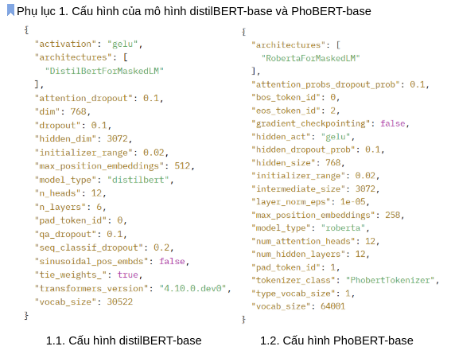
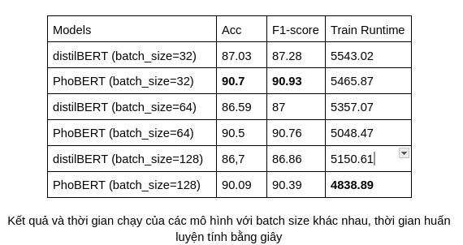
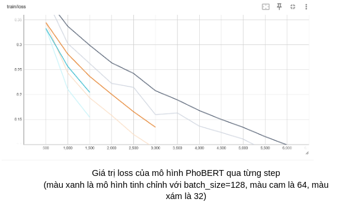
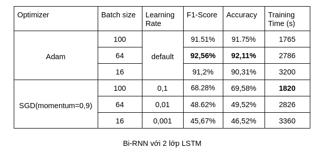
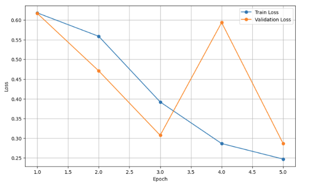
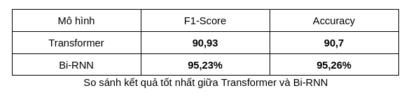

## Project segmentation-analysis

Phân loại cảm xúc bình luận hiểu rõ hơn sự đón nhận của khán giả, hỗ trợ các nhà làm phim, nền tảng phát trực tuyến và nhà tiếp thị đưa ra quyết định (cắt, thêm suất chiếu, thực hiện các cơ hội hay chiến dịch nhanh chóng, đón đầu xu thế). Việc phân loại cảm xúc sẽ gặp 1 số vấn đề: ngôn ngữ đánh giá phim mang tính ẩn dụ cao, ngữ cảnh không rõ ràng, …
Vì những vấn đề nêu trên, để phân loại 1 cách chính xác cần áp dụng các kỹ thuật Xử lý Ngôn ngữ Tự nhiên (NLP) tốt nhằm nắm bắt ngôn ngữ tinh tế hơn.

 
Trong bài báo cáo, chúng em đã thực hiện phân tích và so sánh hai mô hình deep learning hiện đại là Transformer (PhoBERT, DistilBERT) và Bi-RNN (với các lớp LSTM) trong bài toán phân tích cảm xúc dựa trên đánh giá phim bằng tiếng Việt.

#### Danh sách thành viên và công việc:

- Nguyễn Tuấn Thành - 22022624.
- Vũ Đình Thọ - 22022580.
- Đinh Văn Sinh - 22022625.
- Nguyễn Mạnh Hùng - 22022623.
- Nguyễn Công Thành - 22022630.

#### Mục Tiêu

- Xây dựng và triển khai mô hình: Phát triển hai mô hình deep learning là Transformer và Bi-RNN để phân tích cảm xúc.
- Đánh giá và so sánh: So sánh hiệu suất của hai mô hình thông qua các chỉ số như độ chính xác (Accuracy), F1-Score, độ chính xác (Precision) và độ nhạy (Recall).
- Ứng dụng thực tiễn: Ứng dụng kết quả phân tích vào các lĩnh vực như quản lý phản hồi khách hàng, theo dõi đánh giá sản phẩm hoặc giám sát cảm xúc trên mạng xã hội.

#### Data:

Là các bình luận của các bài viết trên facebook được thu thập bằng thư viện Selenium và Pyautogui.
Và dùng Pandas và các thư viện hỗ trợ như emoji, unicodedata, regex, pyvi để chuyển data thành chữ thường, tách từ tiếng việt,
chuẩn hóa từ tiếng việt, chuẩn hóa câu, loại bỏ link, loại bỏ số, loại bỏ các icon và trực quan hóa dữ liệu.

#### Training:

- Transformer:

  - Ta sẽ tinh chỉnh và đánh giá 2 mô hình transformers chỉ sử dụng bộ Encode với tập dữ liệu trên cho bài toán phân loại cảm xúc. 2 mô hình được sử dụng là DistilBERT-base và PhoBERT-base.
  - Phần cứng được sử dụng trong quá trình tinh chỉnh là 2 GPU T4 trên môi trường của Kaggle, các mô hình sẽ được đánh giá thông qua 2 thang đo là độ chính xác và điểm số F1 trên bộ validation.
    
  - Các mô hình được tinh chỉnh với learning rate là 2e-5 trong 5 epochs, sử dụng optimizer AdamW và batch size được tùy chỉnh theo như bảng dưới đây.
    
  - Sau khi tinh chỉnh, ta thấy với batch size nhỏ thì kết quả trả về chính xác hơn nhưng đồng thời thời gian huấn luyện cũng lâu hơn. Mô hình PhoBERT cho ra kết quả tốt hơn so với distilBERT là bởi PhoBERT là mô hình được pre-trained trên bộ dữ liệu tiếng Việt.Do hạn chế về tài nguyên huấn luyện nên ta chỉ có thể đánh giá 2 mô hình trên.
    

- Bi-RNN:
  - Tham số về mô hình : - Lớp embedding : input_dimension = vocab_size = 1585076, embedding_dimension = 100
  - Drop out = 0,5
  - Lớp hidden : sử dụng bidirectional
    - thử nghiệm trên 2 lớp LSTM hoặc 3 lớp LSTM
    - hidden_dimension = 100
  - Hyperparameters :
    - Optimizer : thử nghiệm bằng Adam hoặc SGD
    - Patch size : 16, 64, 100
    - Momentum ( đối với SGD) : 0,9
    - Learning rate :
      - Đối với Adam : mặc định
      - Đối với SGD : thử với các learning rate khác nhau ( 0,1 ; 0,01 ; 0,001)
  - Tiến hành training bằng x 2 GPU : T4 qua 5 epoch. Kết quả của việc tuning các hyperparameter :
    
    
  - Giá trị loss tốt nhất của mô hình Bi-RNN ( batch size = 64, optimizer bằng adam)
    
  - Nhận xét :
    - Khi tăng batch size lên dẫn đến thời gian training giảm
    - Tăng learning rate thì acc của mô hình tăng lên ( đối với optimizer bằng SGD)
    - Phương pháp optimizer bằng Adam tốt hơn SGD
    - Khi mô hình ở batch size = 64 cho ra kết quả tốt nhất so với các batch size khác
    - Mô hình với 3 lớp hidden layer sẽ cho acc cao hơn mô hình với 2 lớp hidden layer
    - Như vậy từ bảng trên có thể thấy rằng, mô hình có acc cao nhất là 95,09% khi mà mô hình có 3 lớp LSTM ở hidden layer , batch size = 64 và optimizer bằng adam

#### Kết luận chung:

- Bi-RNN vượt trội hơn Transformer trong cả F1-Score (95,14% so với 90,93%) và Accuracy (95,09% so với 90,7%), với mức chênh lệch khoảng 4%. Điều này cho thấy Bi-RNN phù hợp hơn với bài toán với bộ dữ liệu đã cho
- Transformer có thể chưa phát huy tối đa tiềm năng, có thể do chưa được tối ưu siêu tham số hoặc dữ liệu không đủ lớn.
- PhoBERT (Transformer) với độ chính xác cao nhất 90.93% là lựa chọn phù hợp cho các bài toán xử lý ngôn ngữ tiếng Việt nhờ khả năng xử lý toàn cục và hiệu suất cao, đặc biệt trong các tập dữ liệu phức tạp. Nhưng hạn chế khi thời gian huấn luyện của dài hơn so với Bi-RNN khi batch size tăng.
- Bi-RNN (với LSTM) với 95.26% độ chính xác vẫn là một phương pháp mạnh mẽ và hiệu quả, đặc biệt khi tài nguyên huấn luyện hạn chế. Khó khăn khi chuỗi dài và có tốc độ huấn luyện chậm hơn khi số lượng layer tăng.
- Kết quả mang lại thể hiện hiệu quả của các mô hình deep learning trong bài toán phân tích cảm xúc và góp phần đóng góp thực tiễn cho phát triển các ứng dụng NLP.

#### Trong dự án có gì sai sót hay cần cải tiến hay nếu có thắc mắc gì mong bạn đóng góp ý vào issuas của repo này ạ☺☺☺.

